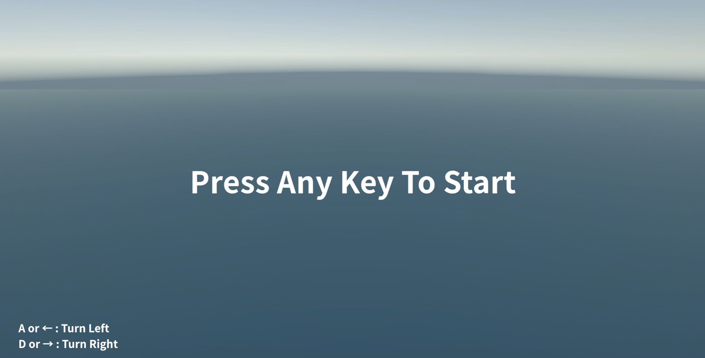
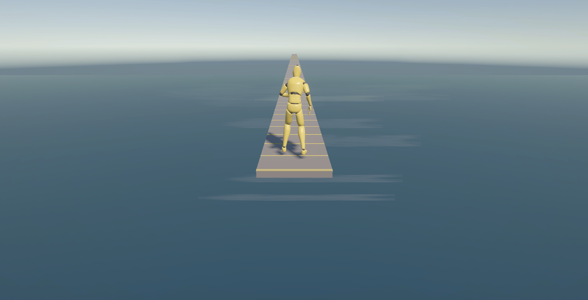
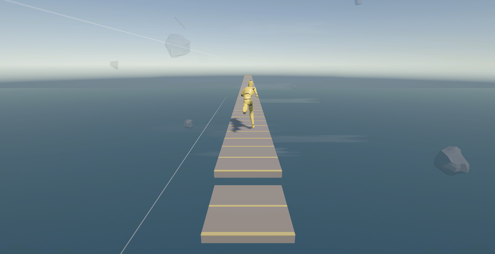
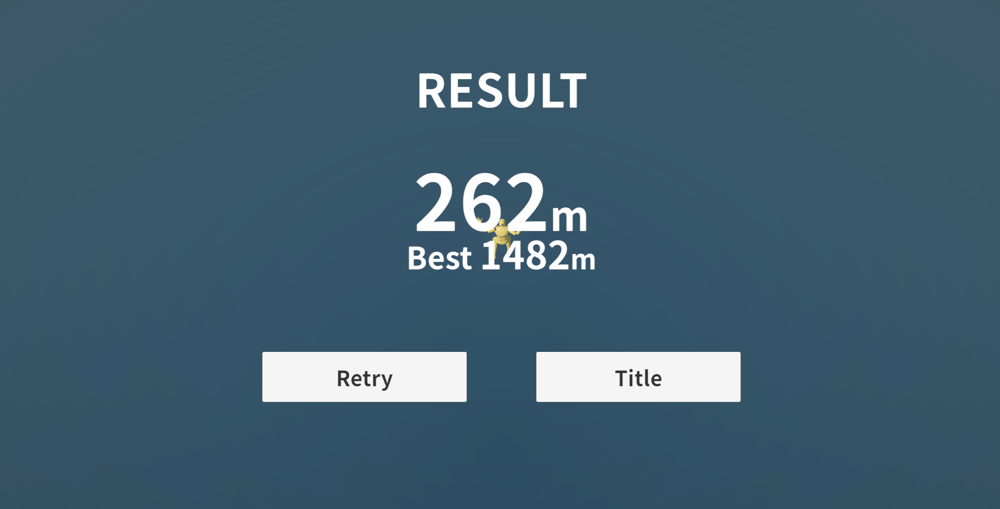
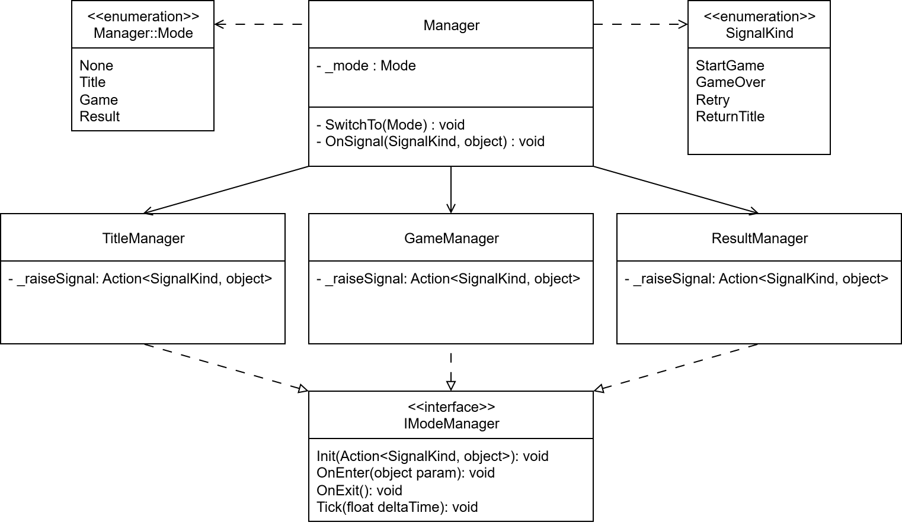

# 第1章　ゲーム全体の構成

ゲームを構成する個々の機能を見ていく前に、まずは本書で取り上げるゲームの全体像と、その構成について確認します。

本章では、ゲームの基本ルールやTitle、Game、Resultという3つのモードを確認したうえで、それらをどのようなクラスに分け、ゲーム全体の進行を管理しているのかを見ていきます。

## 1. ゲームの全体像
本書では、Unityで制作した3D無限ランゲームを題材として、ゲームを構成する各機能やクラスの役割について解説していきます。

まずは、完成したゲームの全体像を確認します。

ゲームは、大きく分けて「タイトル」「ゲーム」「リザルト」の3つの状態で進行します。

### タイトル

ゲームを起動すると、最初にタイトル画面が表示されます。

タイトル画面ではゲームの開始を待ち受けるほか、PCでプレイする場合の基本的な操作方法を表示しています。



<div class="page"></div>

### ゲーム

ゲームを開始すると、プレイヤーキャラクターが空中に敷設された床の上を走り始めます。

ゲーム中は、プレイヤーキャラクター、床タイル、遠景、近景オブジェクト、各種エフェクトなどが組み合わさってゲーム画面を構成します。



プレイヤーの進行に合わせて床は次々と生成され、ステージの状況やゲームの進行に応じて、画面の見た目や演出にも変化が加わります。



<div class="page"></div>

### リザルト

ゲームが終了すると、リザルト画面へ移行します。

リザルト画面では、そのプレイでの走破距離とベスト記録を表示します。
ここからゲームを再挑戦するか、タイトル画面へ戻ることができます。



このように、本書で扱うゲームは、タイトルからゲームを開始し、ゲーム終了後にリザルトを表示するという一連の流れを持っています。

## 2. ゲームの基本ルール

本書で取り上げるゲームは、プレイヤーキャラクターが空中に敷設された床の上を走り続け、できるだけ長い距離を走破することを目的とした無限ランゲームです。

プレイヤーキャラクターは、ゲーム開始後に自動で前方へ走り続けます。
プレイヤー自身が前進操作を行う必要はありません。

プレイヤーが行う主な操作は、左右への方向転換です。
ステージには進行方向が変化する箇所があり、適切なタイミングで左または右へ方向転換しながら走り続けます。

方向転換に失敗するなどして床から落下すると、ゲームオーバーとなります。

ゲームには明確なゴール地点はなく、ゲームオーバーになるまで走行を続けます。
走破した距離が記録され、ゲーム終了後のリザルト画面では、そのプレイでの走破距離とこれまでのベスト記録を確認できます。

ゲームが進行すると、ステージの構成やプレイヤーの走行速度なども変化し、徐々に難易度が上がっていきます。

このように、本ゲームの基本的なルールはシンプルです。
一方で、その動作を実現するためには、プレイヤーの制御、床の生成、方向転換、ゲーム進行、記録の管理など、複数の仕組みを連携させる必要があります。

## 3. Title / Game / Result

本ゲームでは、ゲーム全体の進行を大きく「Title」「Game」「Result」の3つのモードに分けています。

ただし、それぞれのモードごとにUnityのSceneを分けているわけではありません。
本ゲームで使用するSceneは1つだけで、そのSceneの中でTitle、Game、Resultの各モードを切り替えています。

それぞれのモードには役割があり、現在のモードに応じて必要な処理だけを動作させます。

### Title

Titleは、ゲーム開始前の状態です。

タイトル画面を表示し、プレイヤーからゲーム開始の入力を待ち受けます。
ゲーム開始の入力を検知すると、TitleからGameへ移行します。

### Game

Gameは、実際にゲームをプレイしている状態です。

このモードでは、プレイヤーキャラクターの生成や移動、床タイルの生成、走破距離の記録、ゲームオーバー判定など、ゲームプレイに関係する処理を行います。

プレイヤーが床から落下してゲームオーバーになると、そのプレイでの走破距離を結果としてまとめ、Resultへ移行します。

なお、Gameの内部では、ゲーム開始前の準備、プレイ中、ゲームオーバー後といった、さらに細かな状態も管理しています。
これらについては、関係する機能を取り上げる章で詳しく説明します。

### Result

Resultは、ゲーム終了後の状態です。

Gameから受け取った走破距離を表示し、ベスト記録の更新や表示を行います。

リザルト画面からは、もう一度ゲームを開始するか、タイトル画面へ戻るかを選択できます。
再挑戦する場合はGameへ、タイトルへ戻る場合はTitleへ移行します。

ゲーム全体のモード遷移をまとめると、次のようになります。

Title → Game → Result

Resultからは、プレイヤーの選択によってGameまたはTitleへ移行します。

このように、ゲーム全体を役割の異なる3つのモードに分けることで、タイトル画面、ゲームプレイ、リザルト画面それぞれの処理を分離しています。

## 4. ゲーム全体をどう分割するか

前節では、本ゲームがTitle、Game、Resultの3つのモードで進行することを説明しました。

これらすべての処理を1つのクラスにまとめてしまうと、タイトル画面の入力処理、ゲーム中のステージ生成やプレイヤー制御、リザルト画面の表示処理など、役割の異なる処理が混在することになります。

そこで本ゲームでは、ゲーム全体の進行を管理する`Manager`と、それぞれのモードを担当する3つのクラスに役割を分けています。

* `Manager`：現在のモードとモード遷移を管理する
* `TitleManager`：Titleモードを担当する
* `GameManager`：Gameモードを担当する
* `ResultManager`：Resultモードを担当する




### Manager

`Manager`は、ゲーム全体の進行を管理するクラスです。

現在のモードを保持し、Title、Game、Resultのうち、現在有効なモードに対応するManagerだけを更新します。

また、モードが切り替わる際には、これまでのモードの終了処理を呼び出したあと、新しいモードの開始処理を呼び出します。

ゲーム起動時にはTitleから開始し、その後は各モードから送られてくる通知に応じて、次のモードへ切り替えます。

### 各モードを担当するManager

Title、Game、Resultには、それぞれ専用のManagerを用意しています。

たとえば`TitleManager`はタイトル画面の表示やゲーム開始入力の受付を担当し、`GameManager`はステージやプレイヤーを含むゲームプレイ全体を管理します。

`ResultManager`は、ゲーム終了時に渡された結果を受け取り、走破距離やベスト記録を表示します。

各モード固有の処理をそれぞれのクラスへ分けることで、`Manager`自身はゲーム全体の遷移管理に集中できるようにしています。

### IModeManager

3つのモードを担当するManagerは、共通して`IModeManager`インターフェースを実装しています。

`IModeManager`では、各モードが共通して持つ処理を次の4つにまとめています。

* `Init`：モードを初期化する
* `OnEnter`：そのモードへ入る際の処理を行う
* `OnExit`：そのモードから出る際の処理を行う
* `Tick`：そのモード中の更新処理を行う

Title、Game、Resultでは実際に行う処理は異なりますが、「モードへ入る」「モード中に更新する」「モードから出る」という基本的な流れは共通しています。

この共通部分をインターフェースとして定義することで、各モードのクラスが同じライフサイクルを持つ構成にしています。

### モード間の通知

各モードを担当するManagerは、自分自身で次のモードへ切り替えることはしません。

たとえば`TitleManager`がゲーム開始の入力を受け取った場合は、「ゲームを開始したい」という通知を`Manager`へ送ります。

`Manager`はその通知を受け取り、現在のモードと通知の内容をもとに、TitleからGameへ切り替えます。

同様に、Gameでゲームオーバーが発生した場合はResultへ、Resultで再挑戦が選ばれた場合はGameへ、タイトルへ戻る操作が行われた場合はTitleへ切り替えます。

また、通知には必要に応じてデータを含めることができます。
GameからResultへ移行するときには、そのプレイの結果を`GameResult`として渡し、Result側で走破距離の表示などに利用します。

このように本ゲームでは、ゲーム全体の進行を管理するクラスと、各モード固有の処理を担当するクラスを分けています。

## 5. モード管理の実装

前節では、ゲーム全体の進行を管理する`Manager`と、Title、Game、Resultの各モードを担当するManagerの役割について説明しました。

ここからは、これらのクラスが実際にどのようにモードを管理しているのかを、コードを交えながら見ていきます。

まずゲーム全体を管理する`Manager`を確認し、続いて各モードManagerに共通する`IModeManager`インターフェース、最後にTitleからGameへ遷移する処理を例として、モードが切り替わるまでの流れを確認します。

### ゲーム全体のモード遷移を管理するManagerクラス

まずは、ゲーム全体の進行を管理している`Manager`から見ていきます。

#### Mode列挙型とフィールド

```cs
// ゲームが取りうる状態
private enum Mode
{
    None = -1,
    Title,
    Game,
    Result
}

// 各モードManagerインスタンス
[SerializeField] private TitleManager _titleManager;
[SerializeField] private GameManager _gameManager;
[SerializeField] private ResultManager _resultManager;

// モード間のデータのやり取り
private object _lastParam;

// 現在のモードを格納
private Mode _mode = Mode.None;
```

`Manager`では、ゲーム全体が取りうるモードを`Mode`列挙型として定義しています。

このゲームでは、`Title`、`Game`、`Result`の3つのモードを切り替えながら進行します。`None`は、まだいずれのモードにも入っていない初期状態を表します。

`Mode`は`Manager`の外部から利用する必要がないため、`Manager`クラス内部の`private`な列挙型として定義しています。

また、`Manager`は各モードの処理を担当する`TitleManager`、`GameManager`、`ResultManager`への参照を保持しています。`Manager`自身がタイトル画面やゲームプレイ、リザルト画面の処理を行うのではなく、現在のモードに応じて、それぞれを担当するManagerへ処理を委ねます。

現在のモードは`_mode`に保持し、初期値には`Mode.None`を設定しています。

`_lastParam`は、モードを切り替える際にデータを受け渡すためのフィールドです。たとえばGameからResultへ移行するときには、ゲームの結果をこの仕組みを使ってResult側へ渡します。具体的なデータの受け渡しについては、ゲームオーバーとリザルトの処理を扱う章で改めて説明します。

#### 各Managerの初期化
`Awake`では、各モードManagerの初期化と、最初のモードへの遷移を行います。

```cs
private void Awake()
{
    // 各Managerにシグナル通知用のコールバックを設定
    _titleManager.Init(OnSignal);
    _gameManager.Init(OnSignal);
    _resultManager.Init(OnSignal);
    // 最初はTitleモードから開始
    SwitchTo(Mode.Title);
}
```

まず、`TitleManager`、`GameManager`、`ResultManager`の`Init`を呼び出し、シグナル通知用のコールバックとして`Manager`の`OnSignal`メソッドを渡します。

これにより、各モードManagerからシグナルが通知されたときに、`Manager`の`OnSignal`が呼び出されるようになります。

3つのManagerの初期化が完了したら、`SwitchTo`を呼び出して最初のモードである`Title`へ遷移します。


#### 現在のモードの処理を呼び出す

`Update`では、現在のモードに応じて、そのモードを担当するManagerの`Tick`を呼び出します。

```cs
private void Update()
{
    float dt = Time.deltaTime;

    // 現在のモードに対応するManagerの更新処理を呼び出す
    switch (_mode)
    {
        case Mode.Title:
            _titleManager.Tick(dt);
            break;
        case Mode.Game:
            _gameManager.Tick(dt);
            break;
        case Mode.Result:
            _resultManager.Tick(dt);
            break;
    }
}
```

`_mode`の値を確認し、`Title`であれば`TitleManager`、`Game`であれば`GameManager`、`Result`であれば`ResultManager`の`Tick`を呼び出します。

これにより、毎フレームすべてのManagerを更新するのではなく、現在有効なモードを担当するManagerだけが、そのモードで必要な処理を実行します。

`Tick`は3つのManagerに共通して用意している更新処理です。この共通インターフェースについては、後ほど`IModeManager`の説明で取り上げます。


#### モードを切り替える

`SwitchTo`では、現在のモードから引数`next`で指定されたモードへの切り替えを行います。

```cs
private void SwitchTo(Mode next)
{
    RLogger.Log($"{nameof(Manager)}.{nameof(SwitchTo)}. next:{next}. current:{_mode}");

    // 現在のモードと同じ場合は何もしない
    if (_mode == next)
    {
        return;
    }

    // 初期状態でなければ、現在のモードを終了する
    if (_mode != Mode.None)
    {
        switch (_mode)
        {
            case Mode.Title:
                _titleManager.OnExit();
                break;
            case Mode.Game:
                _gameManager.OnExit();
                break;
            case Mode.Result:
                _resultManager.OnExit();
                break;
        }
    }

    // 現在のモードを更新
    _mode = next;

    // 新しいモードを開始する
    switch (_mode)
    {
        case Mode.Title:
            _titleManager.OnEnter(_lastParam);
            break;
        case Mode.Game:
            _gameManager.OnEnter(_lastParam);
            break;
        case Mode.Result:
            _resultManager.OnEnter(_lastParam);
            break;
    }
}
```

まず、切り替え先として指定された`next`が現在のモードと同じ場合は、そのまま処理を終了します。

異なるモードへ切り替える場合は、現在のモードを担当しているManagerの`OnExit`を呼び出し、そのモードの終了処理を行います。ただし、ゲーム起動直後は`Mode.None`から開始するため、この場合は終了するモードが存在せず、`OnExit`の呼び出しを行いません。

現在のモードを終了したあと、`_mode`を`next`へ更新し、新しいモードを担当するManagerの`OnEnter`を呼び出します。

このように、モードを切り替える際には、**現在のモードを終了してから新しいモードを開始する**という順序で処理しています。

#### 各Managerからの通知を受け取る

`OnSignal`は、`Awake`で各モードManagerの`Init`に渡した、シグナル通知を受け取るためのメソッドです。

各モードManagerは、自身で次のモードへ切り替えるのではなく、モードを切り替える条件を満たしたときに`Manager`へシグナルを通知します。

```cs
private void OnSignal(SignalKind signalKind, object param)
{
    _lastParam = param;

    switch (_mode)
    {
        case Mode.Title:
            if (signalKind == SignalKind.StartGame)
            {
                SwitchTo(Mode.Game);
            }
            break;

        case Mode.Game:
            if (signalKind == SignalKind.GameOver)
            {
                SwitchTo(Mode.Result);
            }
            break;

        case Mode.Result:
            if (signalKind == SignalKind.Retry)
            {
                SwitchTo(Mode.Game);
            }
            else if (signalKind == SignalKind.ReturnTitle)
            {
                SwitchTo(Mode.Title);
            }
            break;
    }
}
```

`OnSignal`では、現在のモードと受け取った`SignalKind`の組み合わせから、次に遷移するモードを決定します。

Titleモードで`StartGame`を受け取った場合はGameへ、Gameモードで`GameOver`を受け取った場合はResultへ遷移します。

Resultモードでは、`Retry`を受け取った場合はGameへ、`ReturnTitle`を受け取った場合はTitleへ遷移します。

このように、各モードManagerはモード遷移のきっかけだけを`Manager`へ通知し、実際にどのモードへ切り替えるかは`Manager`が一元的に管理しています。


### 3つのManagerクラスの共通インターフェース IModeManager

`TitleManager`、`GameManager`、`ResultManager`は、共通して`IModeManager`インターフェースを実装しています。

```cs
public interface IModeManager
{
    // モード初期化時に、シグナル通知用のコールバックを受け取る
    void Init(Action<SignalKind, object> raiseSignal);
    // モードに入る際の処理
    void OnEnter(object param);
    // モードから出る際の処理
    void OnExit();
    // モード中の更新処理
    void Tick(float deltaTime);
}
```

3つのManagerは、それぞれ担当する処理が異なります。しかし、各クラスが独自の名称や形式で初期化、開始、終了、更新処理を定義してしまうと、`Manager`から統一的に扱いにくくなります。

そこで`IModeManager`を定義し、各モードManagerが共通して持つ処理の入口をそろえています。

それぞれのメソッドには、次の役割があります。

* `Init`：`Manager`へシグナルを通知するためのコールバックを受け取ります。
* `OnEnter`：そのモードへ遷移したときに呼び出されます。
* `OnExit`：そのモードから別のモードへ遷移するときに呼び出されます。
* `Tick`：そのモードが有効な間、毎フレーム呼び出されます。

インターフェースを実装したからといって、各Managerがこれ以外のpublicなメソッドを自由に定義できなくなるわけではありません。

それでも、モード管理に必要な基本的な処理を`IModeManager`として定義しておくことで、3つのManagerに共通したライフサイクルを持たせ、クラスごとに異なる形式の実装が増えていくことをある程度防いでいます。

### TitleからGameモードへの遷移

Titleモードでは、`TitleManager`の`Tick`が`Manager`から毎フレーム呼び出されます。

`Tick`は`IModeManager`で定義された共通メソッドであるため`deltaTime`を引数として受け取りますが、`TitleManager`では使用していません。

```cs
using UnityEngine.InputSystem;

(中略)

private Action<SignalKind, object> _raiseSignal;

public void Tick(float deltaTime)
{
    // キーボード、マウスのボタン押下を検知したらゲーム開始のシグナルを発行する
    if ((Keyboard.current != null && Keyboard.current.anyKey.wasPressedThisFrame) ||
        (Mouse.current != null && Mouse.current.leftButton.wasPressedThisFrame))
    {
        _raiseSignal.Invoke(SignalKind.StartGame, null);
    }
}
```

キーボードのいずれかのキー、またはマウスの左ボタンが押されたことを検知すると、`SignalKind.StartGame`を`Manager`へ通知します。

`_raiseSignal`には、`Manager`の`Awake`から`TitleManager.Init`を呼び出した際に渡された、シグナル通知用のコールバックが保持されています。

この通知を受け取った`Manager`は、`OnSignal`で`SignalKind.StartGame`を判定し、`SwitchTo(Mode.Game)`を呼び出してGameモードへ遷移します。

なお、実際の`TitleManager`には効果音の再生など、モード遷移とは直接関係しない処理も含まれていますが、ここでは説明を簡潔にするため省略しています。

::: note
**NOTE：Input Systemによる入力取得**

ここではUnityのInput Systemを利用して、キーボードとマウスの入力を取得しています。

`Keyboard.current`は現在使用されているキーボード、`Mouse.current`は現在使用されているマウスを表します。
:::

本章では、ゲーム全体を`Title`、`Game`、`Result`の3つのモードに分け、それぞれの処理を専用の`Manager`へ分担する構成を確認しました。

以降の章では、このゲームを構成しているプレイヤー、ステージ、ゲーム進行、UI、サウンド、演出などを順番に取り上げ、それぞれがどのような役割を持ち、どのように連携しているのかを見ていきます。
